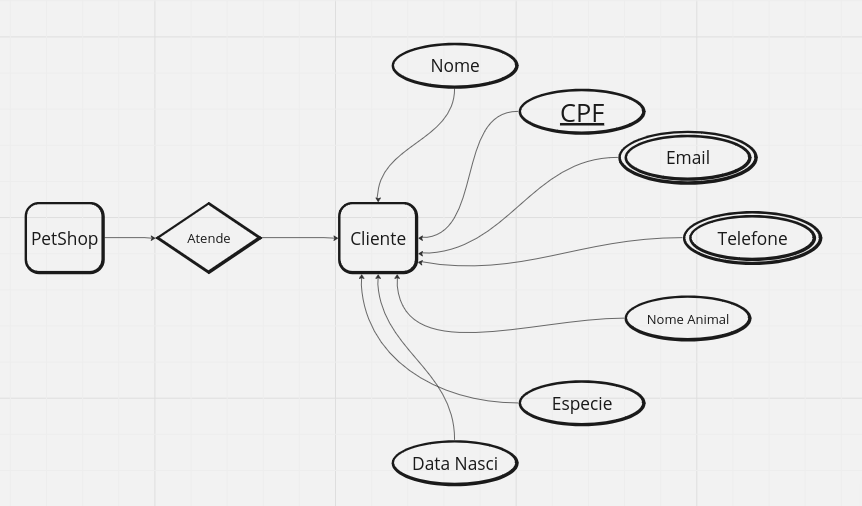
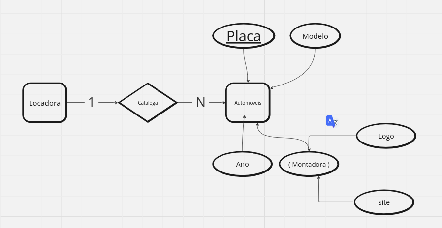
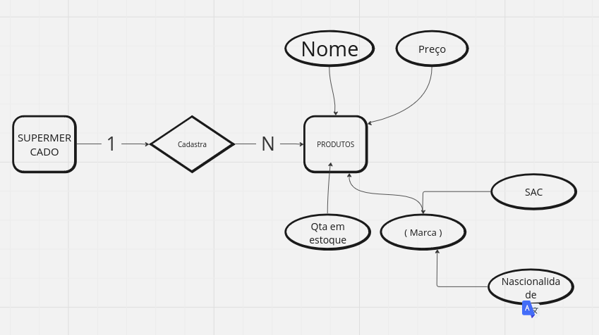

# Atividade individual - SQL 

Orientador: Daniel Oatha

<h1>--------ETAPA 1 / 2 ---------------</h1>

ESTÁ ATIVIDADE CORRESPONDE A ALGUMAS ATIVIDADES APRESENTADAS EM SALA DE AULA;
AULA DO DIA 21/08/23

NESTE EXERCÍCIO SERÁ OBSERVADO A CARDINALIDADE ENTRE OS COMPONENTES APRESENTADOS, ALÉM DA IDENTIFICAÇÃO DOS ELEMENTOS 

Conforme o material apresentado sobre atributos, refaça os MER criados para os exercícios, adaptando com os devidos atributos explicados durante a aula;

1 - Um petshop deseja manter cadastrados seus clientes bem como seus pets.

2 - Em uma produtora de games, há desenvolvedores, que possuem um nome, CPF, data de nascimento.

Uma biblioteca efetua registro de autores e livros.   
  Um autor é cadastrado com seu nome, e-mail, nacionalidade e data de nascimento.   
  Já um livro é registrado com o título, quantidade de páginas, acabamento e editora.

  

  
Uma locadora de automóveis, mantém registro dos automóveis.   
    Um automóvel é cadastrado com placa, modelo, ano,   
    nome da montadora, site da montadora, logotipo da montadora.

    

Um supermercado cadastra seus produtos.  
  Um produto é identificado por seu nome, preço, quantidade em estoque,  
  nome da marca, SAC da marca, nacionalidade da marca.

  

  
Uma videoteca precisa cadastrar o título, duração, idioma original e preço de cada filme.  
    É necessário cadastrar também o elenco de cada filme onde se registra o nome, data de nascimento, nacionalidade de cada ator/atriz. 

<h1>--------ETAPA 3---------------</h1>

Após a criação dos MER, crie as bases de dados de cada um dos exercícios dados na ETAPA 1;

Insira os dados necessários para compor a base de dados criada;

[Link Para Verificar o SQL da BIBLIOTECA](https://www.google.com)

[Link Para Verificar o SQL da LOCADORA](https://www.google.com)

[Link Para Verificar o SQL da PETSHOOP](https://www.google.com)

[Link Para Verificar o SQL da VIDEOTECA](https://www.google.com)

[Link Para Verificar o SQL da PROUDORA-DE-GAMES](https://www.google.com)

[Link Para Verificar o SQL da SUPOER-MERCADO](https://www.google.com)

<h1> --------ETAPA 4--------------- </h1>

Siga as seguintes instruções:

1 — Crie um banco de dados para armazenar dados de alunos. Um aluno deve ter RA, nome, data de nascimento, endereço e e-mail;

2 — Crie um banco de dados para armazenar dados de colaboradores de uma empresa. Um colaborador deve ter um código de identificação, nome, CPF, cargo e salário;

Insira 5 registros em cada tabela;

   
